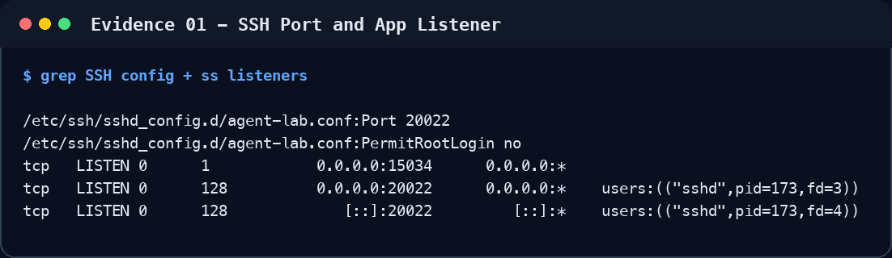
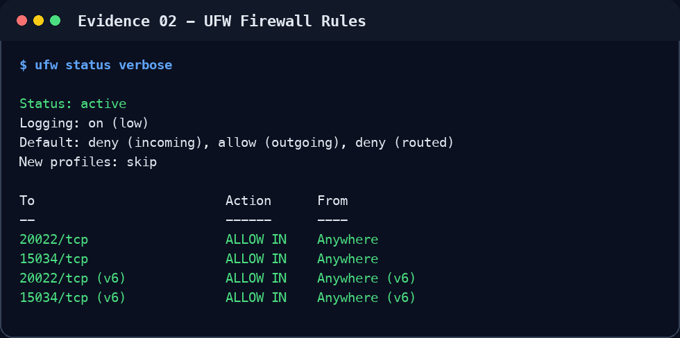
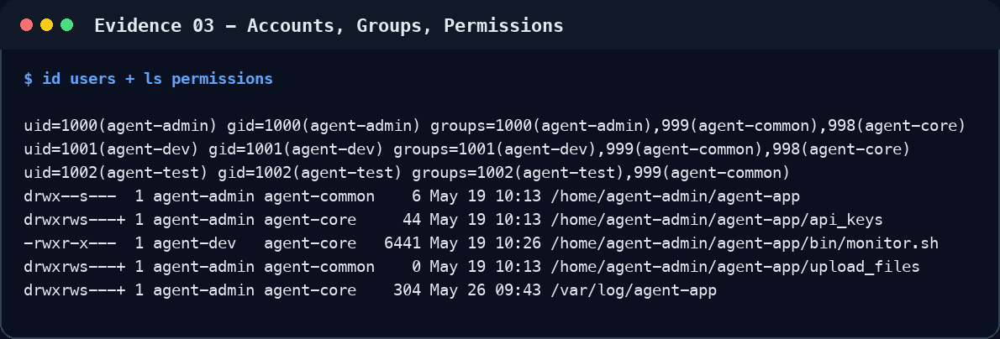
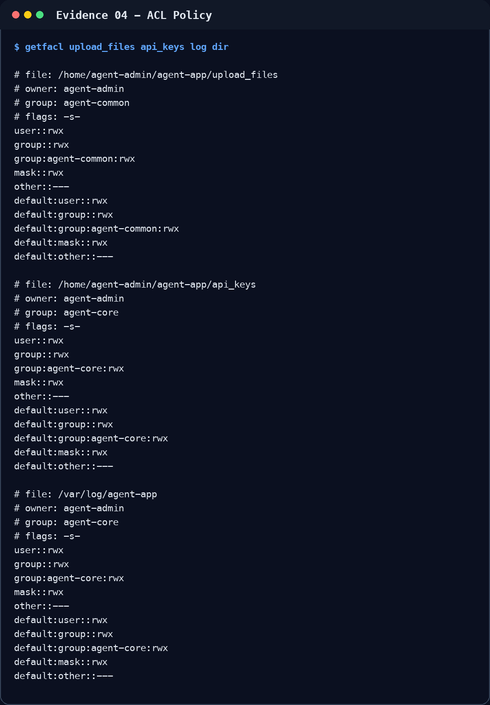
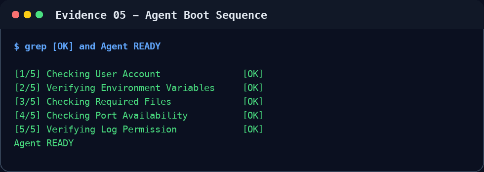
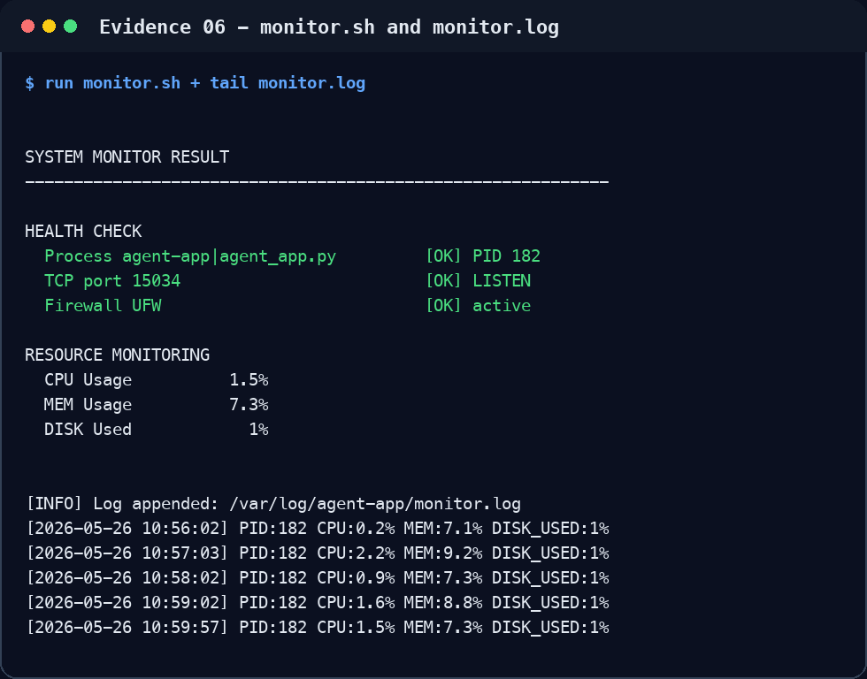
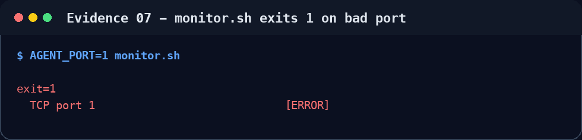
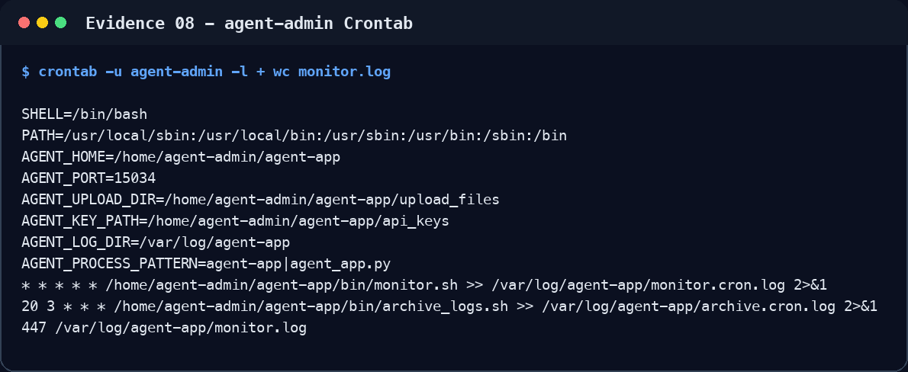
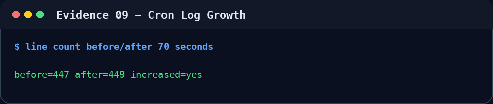
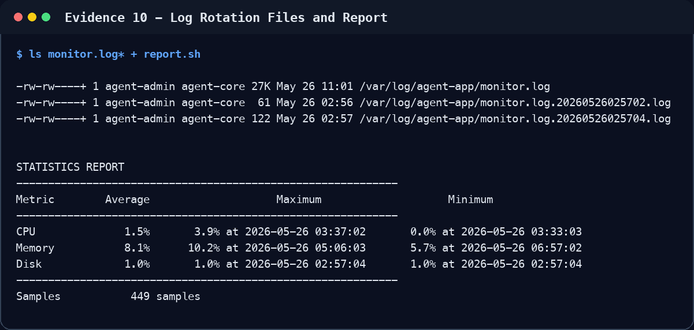

# Linux Agent Monitoring Lab 제출 README

이 저장소는 Ubuntu 22.04 기반 Docker 환경에서 SSH 보안 설정, UFW 방화벽, 역할 기반 계정/그룹/ACL, 제공 Agent 앱 실행, `monitor.sh` 기반 관제 자동화, cron 주기 실행, 로그 용량 관리를 구현한 과제 제출물이다.

평가자가 README만 보더라도 각 평가 기준을 확인할 수 있도록 구현 위치, 검증 명령, 실제 실행 출력, 기술적 설명을 함께 정리했다.

## 1. 실행 환경

- 목표 OS: Ubuntu 22.04 LTS Docker 컨테이너
- 컨테이너 이름: `agent-lab`
- SSH 포트: `20022/tcp`
- Agent 앱 포트: `15034/tcp`
- 방화벽: UFW
- 앱 실행 계정: `agent-admin`
- 모니터링 스크립트 작성자/소유자: `agent-dev`
- 운영 그룹: `agent-core`
- 공용 그룹: `agent-common`
- 로그 디렉토리: `/var/log/agent-app`
- 앱 홈: `/home/agent-admin/agent-app`

제공 앱 산출물인 `agent-app.zip`과 압축 해제된 `agent-app/`은 공개 저장소 추적 대상에서 제외했다. 로컬 실행 시에는 저장소 루트에 `agent-app.zip`을 둔 뒤 실행한다.

```bash
docker compose up --build -d
docker exec -it agent-lab bash
```

상태 점검 보조 스크립트:

```bash
./bin/lab_status.sh
./tests/verify_requirements.sh
```

## 2. 구현 파일

| 파일 | 역할 |
| --- | --- |
| `Dockerfile` | 계정/그룹 생성, SSH 포트와 Root 로그인 정책, 디렉토리 권한/ACL, cron 등록, 앱 설치 |
| `docker-compose.yml` | `20022:20022`, `15034:15034` 포트 매핑과 UFW 실행 권한(`NET_ADMIN`, `NET_RAW`) 설정 |
| `docker/entrypoint.sh` | UFW 활성화, sshd/cron 시작, Agent 앱 일반 계정 실행, 앱 로그 tail |
| `bin/monitor.sh` | 프로세스/포트/방화벽/CPU/MEM/DISK 점검, `monitor.log` 기록, 10MB/10개 회전 |
| `bin/report.sh` | `monitor.log`에서 CPU/MEM/DISK 평균/최대/최소와 샘플 수 리포트 |
| `bin/archive_logs.sh` | 7일 경과 로그 gzip 압축, archive 이동, 30일 경과 archive 삭제 |
| `bin/lab_status.sh` | 실행 중 컨테이너의 요구사항 충족 여부를 한 번에 확인 |
| `submission-report.md` | 수행 내역서 형태의 상세 설명 문서 |

## 3. 평가 기준 대응표

| 기준 | 대응 내용 |
| --- | --- |
| 1. SSH 포트 20022 변경 및 Root 원격 접속 차단 | `Dockerfile`에서 `/etc/ssh/sshd_config.d/agent-lab.conf`에 `Port 20022`, `PermitRootLogin no` 생성 |
| 2. 방화벽 활성화 및 20022/15034 허용 | `docker/entrypoint.sh`의 `configure_firewall()`에서 UFW reset, 기본 inbound deny, `20022/tcp`, `15034/tcp`만 허용 |
| 3. 계정/그룹 구성 | `Dockerfile`에서 `agent-admin`, `agent-dev`, `agent-test`, `agent-common`, `agent-core` 생성 및 그룹 매핑 |
| 4. Boot Sequence 5단계 `[OK]`, `Agent READY` | 앱 콘솔 로그 `/var/log/agent-app/agent-app.console.log`에서 확인 |
| 5. `monitor.sh` 프로세스/포트 점검 및 비정상 `exit 1` | `find_agent_pid()`, `is_port_listening()` 실패 시 `exit 1`; 비정상 포트 테스트 출력 포함 |
| 6. `/var/log/agent-app/monitor.log` 지정 포맷 누적 기록 | `printf '[%s] PID:%s CPU:%s%% MEM:%s%% DISK_USED:%s%%\n' ... >> "$LOG_FILE"` |
| 7. cron 매분 실행으로 로그 자동 증가 | `agent-admin` crontab에 `* * * * * /home/agent-admin/agent-app/bin/monitor.sh ...` 등록 |
| 8. `monitor.log` 용량 관리 10MB/10개 | `MAX_LOG_BYTES=10485760`, active 1개 + rotated 9개 유지 |
| 9. 프로세스/포트 확인 명령 선택 이유 | `ps -eo pid=,comm=,args=` + `awk`, `ss -H -ltn` 선택 이유를 6장에 설명 |
| 10. CPU/MEM/DISK 추출 및 로그 포맷 고정 이유 | `/proc/stat`, `/proc/meminfo`, `df -P /` 사용 이유와 파싱 안정성 설명 |
| 11. 소유자/실행자 권한 정책 | `monitor.sh`는 `agent-dev:agent-core 750`, cron 실행자인 `agent-admin`은 `agent-core` 소속 |
| 12. 용량 기반 로그 관리 구현 방식 | `rotate_log_if_needed()`에서 크기 확인 후 timestamp 파일로 회전, 초과 rotated 파일 삭제 |
| 13. SSH 포트 변경 및 Root 차단 보안 효과 | 자동 스캔 노출 축소와 최고권한 계정 직접 탈취 위험 감소 설명 |
| 14. `api_keys` 및 로그 디렉토리 최소 권한 | `agent-core`에만 R/W 권한, `agent-test` 접근 차단 |
| 15. 경고 분리 운영상 이유 | 프로세스/포트는 장애라 종료, 방화벽/자원 임계값은 관제 지속을 위해 `[WARNING]`만 출력 |
| 16. `>`와 `>>` 차이 및 `>>` 필요성 | `>`는 덮어쓰기, `>>`는 누적 append; 모니터링 로그는 시간 순서 보존 필요 |
| 17. 모니터링 대상 변경 시 핵심 포인트 | `AGENT_PROCESS_PATTERN`, `AGENT_PORT`, 로그 경로, 임계값 변경 |
| 18. 프로세스 생존/포트 닫힘 원인 및 확인 순서 | 바인딩 설정, 포트 충돌, 권한, 방화벽, 앱 초기화 실패 순서로 점검 |
| 19. 로그 급증/디스크 full 대응 | 단기 회전 임계값 하향/압축/삭제, 중기 로그 레벨 조정/원인 제거/외부 저장소 연동 |

## 4. 실제 확인 스크린샷과 출력

아래 스크린샷과 출력은 2026-05-26에 실행 중인 `agent-lab` 컨테이너에서 확인한 대표 증빙이다. PID, CPU, MEM, 샘플 수는 실행 시점에 따라 달라질 수 있다. 스크린샷 원본은 `docs/screenshots/`에 포함했다.

### 4.1 SSH 설정과 포트 상태



검증 명령:

```bash
docker exec agent-lab bash -lc \
  'grep -R "^Port 20022\|^PermitRootLogin no" /etc/ssh/sshd_config /etc/ssh/sshd_config.d 2>/dev/null; ss -tulnp | grep -E ":20022|:15034"'
```

확인 출력:

```text
/etc/ssh/sshd_config.d/agent-lab.conf:Port 20022
/etc/ssh/sshd_config.d/agent-lab.conf:PermitRootLogin no
tcp   LISTEN 0      1            0.0.0.0:15034      0.0.0.0:*
tcp   LISTEN 0      128          0.0.0.0:20022      0.0.0.0:*    users:(("sshd",pid=173,fd=3))
tcp   LISTEN 0      128             [::]:20022         [::]:*    users:(("sshd",pid=173,fd=4))
```

### 4.2 UFW 방화벽



검증 명령:

```bash
docker exec agent-lab bash -lc 'ufw status verbose'
```

확인 출력:

```text
Status: active
Logging: on (low)
Default: deny (incoming), allow (outgoing), deny (routed)
New profiles: skip

To                         Action      From
--                         ------      ----
20022/tcp                  ALLOW IN    Anywhere
15034/tcp                  ALLOW IN    Anywhere
20022/tcp (v6)             ALLOW IN    Anywhere (v6)
15034/tcp (v6)             ALLOW IN    Anywhere (v6)
```

### 4.3 계정, 그룹, 권한



검증 명령:

```bash
docker exec agent-lab bash -lc \
  'id agent-admin; id agent-dev; id agent-test; ls -ld /home/agent-admin/agent-app /home/agent-admin/agent-app/upload_files /home/agent-admin/agent-app/api_keys /var/log/agent-app /home/agent-admin/agent-app/bin/monitor.sh'
```

확인 출력:

```text
uid=1000(agent-admin) gid=1000(agent-admin) groups=1000(agent-admin),999(agent-common),998(agent-core)
uid=1001(agent-dev) gid=1001(agent-dev) groups=1001(agent-dev),999(agent-common),998(agent-core)
uid=1002(agent-test) gid=1002(agent-test) groups=1002(agent-test),999(agent-common)
drwx--s---  1 agent-admin agent-common    6 May 19 10:13 /home/agent-admin/agent-app
drwxrws---+ 1 agent-admin agent-core     44 May 19 10:13 /home/agent-admin/agent-app/api_keys
-rwxr-x---  1 agent-dev   agent-core   6441 May 19 10:26 /home/agent-admin/agent-app/bin/monitor.sh
drwxrws---+ 1 agent-admin agent-common    0 May 19 10:13 /home/agent-admin/agent-app/upload_files
drwxrws---+ 1 agent-admin agent-core    304 May 26 09:43 /var/log/agent-app
```

ACL 확인:



```text
# file: /home/agent-admin/agent-app/upload_files
# owner: agent-admin
# group: agent-common
user::rwx
group::rwx
group:agent-common:rwx
other::---
default:group:agent-common:rwx
default:other::---

# file: /home/agent-admin/agent-app/api_keys
# owner: agent-admin
# group: agent-core
user::rwx
group::rwx
group:agent-core:rwx
other::---
default:group:agent-core:rwx
default:other::---

# file: /var/log/agent-app
# owner: agent-admin
# group: agent-core
user::rwx
group::rwx
group:agent-core:rwx
other::---
default:group:agent-core:rwx
default:other::---
```

### 4.4 Agent 앱 Boot Sequence



검증 명령:

```bash
docker exec agent-lab bash -lc \
  'grep -E "\[OK\]|Agent READY" /var/log/agent-app/agent-app.console.log | tail -n 12'
```

확인 출력:

```text
[1/5] Checking User Account               [OK]
[2/5] Verifying Environment Variables     [OK]
[3/5] Checking Required Files             [OK]
[4/5] Checking Port Availability          [OK]
[5/5] Verifying Log Permission            [OK]
Agent READY
```

### 4.5 `monitor.sh` 수동 실행과 누적 로그



검증 명령:

```bash
docker exec agent-lab bash -lc \
  'sudo -u agent-admin /home/agent-admin/agent-app/bin/monitor.sh; tail -n 5 /var/log/agent-app/monitor.log'
```

확인 출력:

```text
SYSTEM MONITOR RESULT
------------------------------------------------------------

HEALTH CHECK
  Process agent-app|agent_app.py         [OK] PID 182
  TCP port 15034                         [OK] LISTEN
  Firewall UFW                           [OK] active

RESOURCE MONITORING
  CPU Usage          1.5%
  MEM Usage          7.3%
  DISK Used            1%

[INFO] Log appended: /var/log/agent-app/monitor.log
[2026-05-26 10:56:02] PID:182 CPU:0.2% MEM:7.1% DISK_USED:1%
[2026-05-26 10:57:03] PID:182 CPU:2.2% MEM:9.2% DISK_USED:1%
[2026-05-26 10:58:02] PID:182 CPU:0.9% MEM:7.3% DISK_USED:1%
[2026-05-26 10:59:02] PID:182 CPU:1.6% MEM:8.8% DISK_USED:1%
[2026-05-26 10:59:57] PID:182 CPU:1.5% MEM:7.3% DISK_USED:1%
```

비정상 포트 점검 시 `exit 1` 확인:



```bash
docker exec agent-lab bash -lc \
  'set +e; sudo -u agent-admin env AGENT_PORT=1 /home/agent-admin/agent-app/bin/monitor.sh >/tmp/monitor_fail.out 2>&1; rc=$?; echo exit=$rc; grep -E "TCP port 1|ERROR" /tmp/monitor_fail.out'
```

```text
exit=1
  TCP port 1                             [ERROR]
```

### 4.6 cron 자동 실행과 로그 증가



검증 명령:

```bash
docker exec agent-lab bash -lc 'crontab -u agent-admin -l; wc -l /var/log/agent-app/monitor.log'
```

확인 출력:

```text
SHELL=/bin/bash
PATH=/usr/local/sbin:/usr/local/bin:/usr/sbin:/usr/bin:/sbin:/bin
AGENT_HOME=/home/agent-admin/agent-app
AGENT_PORT=15034
AGENT_UPLOAD_DIR=/home/agent-admin/agent-app/upload_files
AGENT_KEY_PATH=/home/agent-admin/agent-app/api_keys
AGENT_LOG_DIR=/var/log/agent-app
AGENT_PROCESS_PATTERN=agent-app|agent_app.py
* * * * * /home/agent-admin/agent-app/bin/monitor.sh >> /var/log/agent-app/monitor.cron.log 2>&1
20 3 * * * /home/agent-admin/agent-app/bin/archive_logs.sh >> /var/log/agent-app/archive.cron.log 2>&1
447 /var/log/agent-app/monitor.log
```

1분 후 증가 확인 명령:



```bash
docker exec agent-lab bash -lc \
  'before=$(wc -l < /var/log/agent-app/monitor.log); sleep 70; after=$(wc -l < /var/log/agent-app/monitor.log); printf "before=%s after=%s increased=%s\n" "$before" "$after" "$([ "$after" -gt "$before" ] && printf yes || printf no)"'
```

실제 확인 출력:

```text
before=447 after=449 increased=yes
```

`after`가 `before`보다 커졌으므로 cron 매분 실행으로 `monitor.log`가 자동 증가한다.

### 4.7 로그 용량 관리와 리포트



`monitor.sh` 내부 기본값:

```bash
MAX_LOG_BYTES="${MAX_LOG_BYTES:-10485760}"
KEEP_ROTATED="${KEEP_ROTATED:-9}"
```

동작 방식:

- `monitor.log`가 10MB 이상이면 `monitor.log.YYYYMMDDHHMMSS.log`로 이동한다.
- 새 `monitor.log`를 만들고 권한을 `0660`으로 맞춘다.
- active 파일 1개와 rotated 파일 9개를 유지해 총 10개 파일 정책을 만족한다.
- 오래된 rotated 파일은 `ls -1t ... | awk 'NR > keep' | xargs -r rm -f`로 삭제한다.

확인 출력:

```text
-rw-rw----+ 1 agent-admin agent-core 27K May 26 11:01 /var/log/agent-app/monitor.log
-rw-rw----+ 1 agent-admin agent-core  61 May 26 02:56 /var/log/agent-app/monitor.log.20260526025702.log
-rw-rw----+ 1 agent-admin agent-core 122 May 26 02:57 /var/log/agent-app/monitor.log.20260526025704.log
```

`report.sh` 실행 출력:

```text
STATISTICS REPORT
------------------------------------------------------------
Metric        Average                    Maximum                    Minimum
------------------------------------------------------------
CPU              1.5%       3.9% at 2026-05-26 03:37:02       0.0% at 2026-05-26 03:33:03
Memory           8.1%      10.2% at 2026-05-26 05:06:03       5.7% at 2026-05-26 06:57:02
Disk             1.0%       1.0% at 2026-05-26 02:57:04       1.0% at 2026-05-26 02:57:04
------------------------------------------------------------
Samples           449 samples
```

## 5. `monitor.sh` 핵심 구현

전체 구현은 `bin/monitor.sh`에 있다. 평가 기준에서 요구하는 핵심 로직은 아래와 같다.

프로세스 식별:

```bash
find_agent_pid() {
  ps -eo pid=,comm=,args= | awk \
    -v me="$$" \
    -v parent="$PPID" \
    -v pattern="$AGENT_PROCESS_PATTERN" '
      $1 == me || $1 == parent { next }
      $2 ~ /^(awk|bash|cron|grep|monitor\.sh|ps|runuser|sh|sudo|tail)$/ { next }
      $0 ~ /monitor\.sh/ { next }
      $2 ~ /^agent-app/ || $0 ~ /agent_app\.py/ || $0 ~ pattern {
        print $1
        exit
      }
    '
}
```

포트 확인:

```bash
is_port_listening() {
  ss -H -ltn 2>/dev/null | awk -v port="$AGENT_PORT" '
    {
      n = split($4, parts, ":")
      if (parts[n] == port) {
        found = 1
      }
    }
    END { exit found ? 0 : 1 }
  '
}
```

프로세스/포트 실패 시 종료:

```bash
pid="$(find_agent_pid)"
if [ -z "$pid" ]; then
  status_line "Process ${AGENT_PROCESS_PATTERN}" "ERROR"
  exit 1
fi

if ! is_port_listening; then
  status_line "TCP port ${AGENT_PORT}" "ERROR"
  exit 1
fi
```

로그 누적 기록:

```bash
timestamp="$(date '+%Y-%m-%d %H:%M:%S')"
printf '[%s] PID:%s CPU:%s%% MEM:%s%% DISK_USED:%s%%\n' "$timestamp" "$pid" "$cpu" "$mem" "$disk" >> "$LOG_FILE"
chmod 0660 "$LOG_FILE" 2>/dev/null || true
```

## 6. 기술 설명 답변

### 6.1 프로세스 식별과 포트 확인 명령 선택 이유

프로세스 식별은 `ps -eo pid=,comm=,args=`와 `awk`를 사용했다. `pgrep -f`는 검색 문자열에 따라 `monitor.sh`, `grep`, `awk` 같은 자기 자신 또는 보조 프로세스를 함께 잡을 수 있어 오탐 가능성이 있다. 그래서 현재 PID, 부모 PID, 모니터링 관련 명령을 제외한 뒤 `agent-app` 또는 `agent_app.py` 패턴만 선택한다.

포트 확인은 `ss -H -ltn`을 사용했다. `ss`는 최신 Linux에서 `netstat`보다 기본 도구에 가깝고, TCP LISTEN 소켓을 직접 확인할 수 있다. `awk`로 local address의 마지막 `:` 뒤 값을 비교해 `15034`가 실제로 LISTEN 상태인지 판단한다.

### 6.2 CPU/MEM/DISK 추출 방식과 로그 포맷 고정 이유

CPU는 `/proc/stat`의 전체 CPU tick과 idle tick을 1초 간격으로 두 번 읽어 delta를 계산한다. 계산식은 `100 * (total_delta - idle_delta) / total_delta`이다. 순간값이 아니라 짧은 구간의 변화량을 보므로 단일 snapshot보다 실제 사용률에 가깝다.

메모리는 `/proc/meminfo`의 `MemTotal`과 `MemAvailable` 차이로 계산한다. `MemFree`만 쓰면 page cache와 buffer를 사용 중 메모리로 과대평가할 수 있으므로, 실제로 새 프로세스에 내줄 수 있는 `MemAvailable`을 기준으로 삼았다.

디스크는 `df -P /`의 root partition 사용률을 사용한다. `-P`는 POSIX 출력 형식을 강제하므로 스크립트에서 열 위치를 안정적으로 파싱할 수 있다.

로그 포맷은 아래처럼 고정했다.

```text
[YYYY-MM-DD HH:MM:SS] PID:... CPU:..% MEM:..% DISK_USED:..%
```

`report.sh`가 timestamp, CPU, MEM, DISK 값을 키 이름 기준으로 안정적으로 파싱해야 하므로 키 이름과 순서를 일정하게 유지한다. 운영 로그는 사람이 읽을 수 있어야 하면서도 후속 스크립트가 깨지지 않아야 한다.

### 6.3 소유자 및 실행자 권한 정책

`monitor.sh`는 `agent-dev:agent-core 750`으로 설치했다. 작성 및 변경 책임은 `agent-dev`에 두고, 실행 권한은 운영 그룹인 `agent-core`에만 열었다. cron 실행 계정인 `agent-admin`은 `agent-core`에 포함되어 있으므로 매분 실행할 수 있고, `agent-test`는 `agent-core`가 아니므로 실행할 수 없다.

`$AGENT_HOME`은 `agent-admin:agent-common 2710`으로 설정했다. 공용 작업자는 필요한 디렉토리로 진입할 수 있지만 홈 전체를 읽지는 못한다. `upload_files`는 `agent-common 2770`으로 admin/dev/test 모두 읽고 쓸 수 있다. 반면 `api_keys`와 `/var/log/agent-app`은 `agent-core 2770`으로 제한해 admin/dev만 접근 가능하다.

### 6.4 용량 기반 로그 관리 구현 방식

용량 관리는 `monitor.sh` 내부 `rotate_log_if_needed()`에서 수행한다. `wc -c`로 `monitor.log` 크기를 확인하고, `10485760` bytes 이상이면 timestamp가 붙은 rotated 파일로 이동한다. 이후 새 active 로그 파일을 만들고 `0660` 권한을 적용한다.

보관 개수는 active 파일 1개와 rotated 파일 9개다. 즉 평가 기준의 10MB/10개 정책을 만족한다. rotated 파일은 최신순으로 정렬한 뒤 9개를 초과하는 파일을 삭제한다.

추가 보존 정책은 `archive_logs.sh`가 담당한다. 7일 이상 지난 `/var/log/agent-app/*.log`를 gzip으로 압축해 `/var/log/monitor/agent-app/archive/`로 옮기고, 30일 이상 지난 `.gz` 파일을 삭제한다.

### 6.5 SSH 보안 설정의 위협 모델

SSH 기본 포트 `22`는 인터넷 스캐너와 봇이 가장 먼저 시도하는 대상이다. 포트를 `20022`로 바꾸면 보안 자체가 완성되는 것은 아니지만, 무작위 자동 스캔과 기본 포트 대상 brute force 시도의 노출을 줄인다.

Root 원격 접속 차단은 더 중요하다. Root는 모든 권한을 가진 단일 최고권한 계정이므로, 원격에서 바로 로그인할 수 있으면 계정 탈취 시 피해 범위가 즉시 전체 시스템으로 확장된다. 일반 계정으로 로그인한 뒤 필요한 경우에만 권한 상승을 하게 만들면 사용자별 감사 추적과 최소 권한 운영이 가능하다.

### 6.6 `api_keys`와 로그 디렉토리 최소 권한 원칙

`api_keys`는 인증 정보가 들어 있는 보안 디렉토리이고, `/var/log/agent-app`는 앱 상태와 장애 정보가 남는 운영 디렉토리다. QA 역할인 `agent-test`가 이 정보에 접근할 필요는 없으므로 두 디렉토리는 `agent-core`에만 열었다.

이 정책은 최소 권한 원칙을 따른다. 사용자는 업무에 필요한 권한만 가져야 하며, 공용 업로드 작업에는 `agent-common`, 키와 운영 로그에는 `agent-core`를 사용해 접근 범위를 분리했다.

### 6.7 경고를 분리한 운영상 이유

프로세스가 없거나 포트가 닫혀 있으면 서비스가 실제로 동작하지 않는 상태이므로 `monitor.sh`는 `exit 1`로 종료한다. 이 경우 cron 로그나 외부 감시 시스템에서 실패를 즉시 감지해야 한다.

반면 방화벽 비활성, CPU/MEM/DISK 임계값 초과는 즉시 관제 자체를 중단할 사유가 아니다. 이런 상태에서 스크립트가 종료되면 가장 필요한 시점에 리소스 로그가 남지 않는다. 따라서 `[WARNING]`으로 분리해 운영자가 위험 신호를 보면서도 로그 수집은 계속되게 했다.

### 6.8 리다이렉션 `>`와 `>>` 차이

`>`는 파일을 새로 만들거나 기존 파일 내용을 덮어쓴다. `>>`는 기존 파일 끝에 내용을 추가한다.

모니터링 로그는 시간 순서대로 계속 쌓여야 장애 발생 전후의 흐름을 추적할 수 있다. 그래서 `monitor.log` 기록과 cron 출력에는 `>>`를 사용한다. `>`를 사용하면 매 실행마다 이전 로그가 사라져 누적 관제 요구사항을 만족할 수 없다.

### 6.9 모니터링 대상 변경 시 수정 포인트

대상이 Nginx 같은 웹 서버로 바뀌면 다음 값을 우선 변경한다.

- `AGENT_PROCESS_PATTERN`: 예를 들어 `nginx`
- `AGENT_PORT`: 예를 들어 `80` 또는 `443`
- 로그 파일 경로: 서비스별 로그 위치로 변경
- CPU/MEM/DISK 임계값: 서비스 특성에 맞게 조정
- 권한 정책: 새 서비스 실행 계정이 로그 디렉토리에 쓸 수 있는지 확인

핵심은 프로세스 생존 확인과 포트 LISTEN 확인이 같은 서비스를 가리키도록 맞추는 것이다. 프로세스명만 바꾸고 포트를 바꾸지 않으면 살아 있는 다른 서비스와 혼동할 수 있다.

### 6.10 프로세스는 살아 있는데 포트가 닫힌 경우 확인 순서

가능한 원인은 앱 초기화 실패, 바인딩 주소/포트 설정 오류, 포트 충돌, 권한 문제, 방화벽 또는 네트워크 네임스페이스 문제다.

확인 순서는 다음과 같다.

1. `ps -eo pid,comm,args | grep agent`로 프로세스 실행 인자 확인
2. `ss -ltnp | grep 15034`로 실제 LISTEN 여부 확인
3. `/var/log/agent-app/agent-app.console.log`에서 Boot Sequence 또는 런타임 오류 확인
4. `env | grep '^AGENT_'`로 앱 포트와 경로 환경 변수 확인
5. `ufw status verbose`로 방화벽 허용 규칙 확인
6. 같은 포트를 다른 프로세스가 점유하는지 `ss -ltnp` 전체 출력으로 확인

### 6.11 로그 급증으로 디스크가 찰 때 대응

단기 대응은 디스크를 즉시 보호하는 것이다. `MAX_LOG_BYTES`를 낮춰 회전을 빠르게 하고, 오래된 로그를 gzip 압축하거나 삭제한다. 필요하면 `archive_logs.sh`를 수동 실행해 `/var/log/monitor/agent-app/archive/`로 옮긴다. 디스크 사용률이 높으면 불필요한 임시 파일도 함께 정리한다.

중기 대응은 로그가 급증한 원인을 줄이는 것이다. 반복 오류를 수정하고, 앱 로그 레벨을 조정하며, 동일 메시지가 과도하게 반복되지 않도록 rate limit을 둔다. 운영 규모가 커지면 로컬 디스크에만 의존하지 않고 중앙 로그 저장소나 모니터링 시스템으로 전송해 보존과 검색을 분리한다.

## 7. 제출 전 체크리스트

- [x] SSH `Port 20022` 확인
- [x] SSH `PermitRootLogin no` 확인
- [x] UFW active 확인
- [x] UFW inbound allow가 `20022/tcp`, `15034/tcp`만 있는지 확인
- [x] `agent-admin`, `agent-dev`, `agent-test` 생성 확인
- [x] `agent-common`, `agent-core` 그룹 매핑 확인
- [x] `upload_files`, `api_keys`, `/var/log/agent-app` 권한/ACL 확인
- [x] Boot Sequence 5단계 `[OK]` 확인
- [x] `Agent READY` 확인
- [x] `monitor.sh` 수동 실행 확인
- [x] 비정상 포트에서 `exit 1` 확인
- [x] `/var/log/agent-app/monitor.log` 누적 기록 확인
- [x] `agent-admin` crontab 매분 실행 확인
- [x] 1분 후 `monitor.log` 증가 확인 명령 제공
- [x] 10MB/10개 로그 회전 정책 설명
- [x] 프로세스/포트/자원 수집 방식 설명
- [x] 권한/최소 권한/보안 위협 모델 설명
- [x] 장애 대응 및 디스크 full 대응 설명
